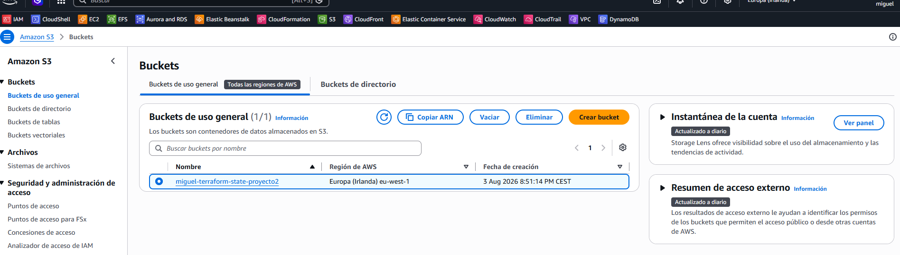
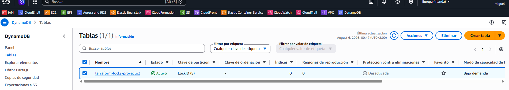
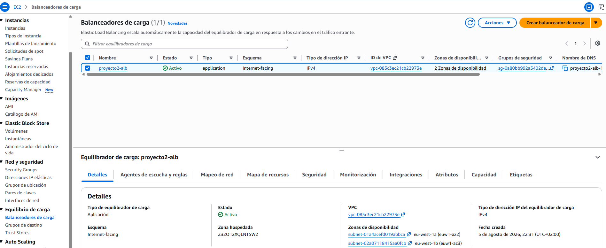
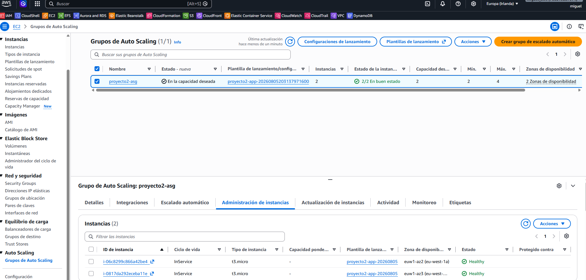
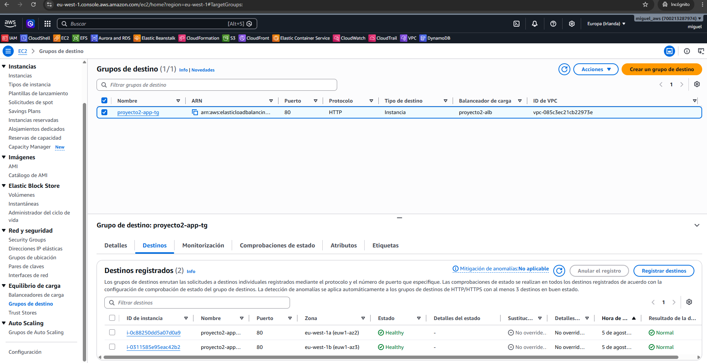
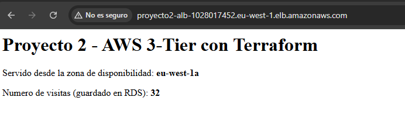
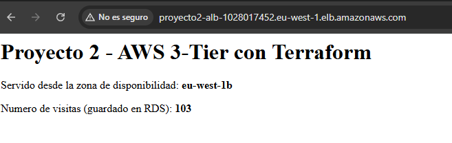
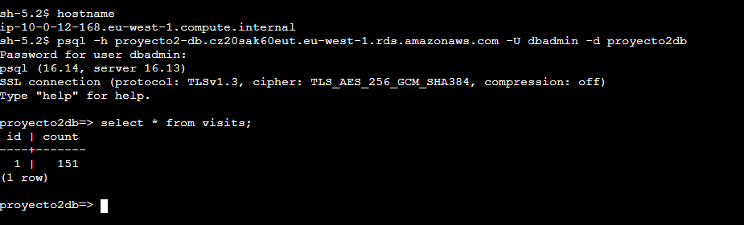
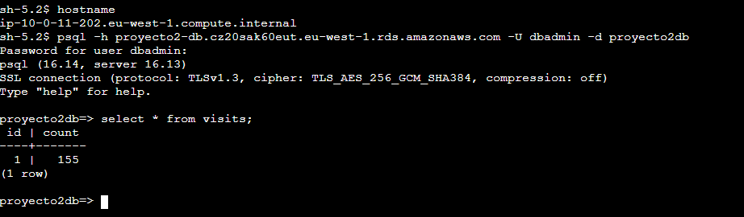

# Arquitectura Web de 3 Capas en AWS — con Terraform

+ Este proyecto coge la arquitectura de [aws-3-tier-web-architecture](https://github.com/mamoros-dev/aws-3-tier-web-architecture)
(la que monté a mano en consola en el Proyecto 1) y la recrea entera con Terraform. 


+ La idea era aprender IaC sin tener que pelearme a la vez con una arquitectura nueva — así cualquier problema que me saliera sabía que era de Terraform, no de la arquitectura en sí.

## Cómo está montado

+ Internet → ALB (subred pública) → Target Group → Auto Scaling Group (subred privada de app) → RDS PostgreSQL (subred privada de datos):
    - VPC con 6 subredes repartidas en 2 AZs (públicas, app, datos)
    - Una NAT Gateway (por coste, lo explico más abajo)
    - Security Groups encadenados: alb → app → rds, cada uno referenciando al anterior por ID, no por IP
    - IAM Role + Instance Profile para entrar por Session Manager, sin SSH ni claves
    - Auto Scaling Group con 2 instancias mínimo, repartidas en las 2 AZs
    - ALB con health checks al Target Group
    - RDS PostgreSQL en subred privada, sin acceso público

## Cómo levantarlo

```
terraform init
terraform plan -out=tfplan
terraform apply "tfplan"
```
> Hace falta un `terraform.tfvars` con al menos `db_password` puesto (mira `terraform.tfvars.example`
para ver qué variables necesita).

## Infraestructura desplegada y funcionando

+ El estado de Terraform vive en un bucket S3, no en mi disco. Así, si algún día trabajo desde otro portátil, o si esto lo lleva más gente, todos leemos el mismo estado:

    > Tiene el versionado activado, por si algún día un `apply` deja el estado en mal estado, poder volver a una versión anterior del archivo. También el acceso público bloqueado, porque el estado puede tener datos sensibles.

+ Tabla DynamoDB para el locking del estado:

    > Esta tabla es la que evita que dos `apply` se ejecuten a la vez sobre el mismo estado. Cuando lanzo un `apply`, Terraform escribe un lock aquí antes de tocar nada; si alguien (o yo mismo desde otro sitio) intentara aplicar algo al mismo tiempo, le saldría un error de estado bloqueado en vez de corromper el archivo. Solo estoy yo trabajando en esto, pero es el mismo mecanismo que usaría un equipo entero, y quería tenerlo desde el principio en vez de añadirlo después.

+ El ALB funcionando en ambas AZs con subnet públicas:


+ El Auto Scaling Group manteniendo sus 2 instancias sanas:


+ Y el Target Group confirmando que ambas pasan los health checks del Load Balancer:



## Prueba de que funciona de verdad, no solo en el diagrama

+ En vez de dejar un `phpinfo()` a secas, hice una página sencilla que muestra en qué zona de disponibilidad está corriendo la instancia que te ha tocado, y un contador de visitas guardado en RDS. 
+ Refrescando varias veces, se ve el ALB repartiendo entre las dos AZs y el contador subiendo de verdad desde la base de datos, no simulado.



+ Entrando por Session Manager (sin SSH):
    ```
    $ aws ssm start-session --target i-xxxx --region eu-west-1 --profile personal
    ```
+ Comprobando que RDS solo se ve desde dentro: Desde mi portátil, el endpoint de RDS no responde nada (y así tiene que ser, es la prueba de que el Security Group está bien hecho). Desde dentro de una instancia de la app, con `psql`, sí conecta:
    ```
    $ psql -h proyecto2-db.cz20sak60eut.eu-west-1.rds.amazonaws.com -U dbadmin -d proyecto2db
    proyecto2db=> SELECT * FROM visits;
    ```
    
    

## Verificando que Terraform gestiona todo y no hay nada tocado a mano

```
$ terraform state list | wc -l
31

$ terraform plan
No changes. Your infrastructure matches the configuration.
Terraform has compared your real infrastructure against your configuration and found no differences, so no changes are needed.
```
> Esto es lo que en un equipo real se llama "drift" — cuando alguien cambia algo a mano en la consola y el código deja de reflejar lo que hay desplegado de verdad. Aquí no hay ninguno: todo lo que existe en AWS está descrito en este repo.

## Decisiones que tomé (y por qué)

- **Backend remoto (S3 + DynamoDB) desde el primer commit**, no lo dejé para luego. El estado de Terraform puede tener secretos, así que no lo dejo en local ni sin cifrar.
- **Todo con variables desde el principio**, nada de valores puestos directamente. Así este mismo código vale para otro entorno solo cambiando el `.tfvars`.
- **La contraseña de RDS va como variable `sensitive`**, con el valor real solo en `terraform.tfvars`, que está en el `.gitignore`. Nunca en el código que se sube a GitHub.
- **Una sola NAT Gateway, no una por AZ.** En Proyecto 1 ya vi que la NAT era la parte más cara del mes. Para un proyecto de portfolio no le veo sentido duplicar ese coste; en un entorno real con tráfico de verdad, sí pondría una por AZ para no depender de un único punto de fallo.
- **RDS sin Multi-AZ**, mismo motivo que la NAT.
- **IMDSv2 forzado** en las instancias (`http_tokens = "required"`), por seguridad — evita el tipo de ataque que podría explotar IMDSv1.
- **`skip_final_snapshot = true`** en RDS, para no acumular snapshots (y su coste) cada vez que destruyo y vuelvo a crear el proyecto para practicar.

## Lo que no salió a la primera (y cómo lo arreglé)

- **RDS me rechazó la contraseña** la primera vez que hice `apply`. Resulta que la API de RDS no admite `/`, `@`, `"` ni espacios en la contraseña. Lo vi en el mensaje de error y cambié la contraseña en el `.tfvars`.
- **Los acentos en las `description` de los Security Groups también dieron error** de validación — la API de AWS solo admite un set concreto de caracteres ahí, sin tildes. Lo quité y ya.
- **Después de que todo se creara bien, Session Manager no conectaba a las instancias.** Al final era que el agente de SSM no estaba arrancando solo en la AMI de Amazon Linux 2023 que estaba usando. Lo arreglé forzando su instalación y arranque en el `user_data`. Aquí aprendí algo importante: cambiar el Launch Template no relanza las instancias que ya están corriendo, solo afecta a las que se creen después. Tuve que terminar las instancias a mano para que el ASG las recreara ya con el `user_data` bueno.

## Qué le añadiría si esto fuera a producción

- `instance_refresh` en el ASG, para que al cambiar el Launch Template las instancias se vayan reemplazando solas de una en una, sin tener que terminarlas a mano como hice yo aquí.
- NAT Gateway y RDS Multi-AZ, para quitar los puntos únicos de fallo que dejé por ahorrar coste.
- HTTPS en el ALB con un certificado de ACM.
- Cambiar el locking de DynamoDB por el `use_lockfile` nativo de S3, ahora que Terraform 1.11+ lo soporta — de momento me quedé con DynamoDB porque es lo que más se ve todavía en proyectos reales.

## Stack

+ Terraform 1.15 · AWS (VPC, EC2, ASG, ALB, RDS, IAM) · Systems Manager · Backend remoto en S3 + DynamoDB

## Estado

+ Terminado y verificado. Lo he destruido después de comprobar que todo funcionaba, para no dejarme la NAT Gateway y RDS consumiendo crédito sin necesidad. Se levanta entero otra vez con `terraform apply` en unos minutos.

## Autor

+ Miguel — [GitHub](https://github.com/mamoros-dev) · [LinkedIn](https://www.linkedin.com/in/miguel-amoros-moret/)