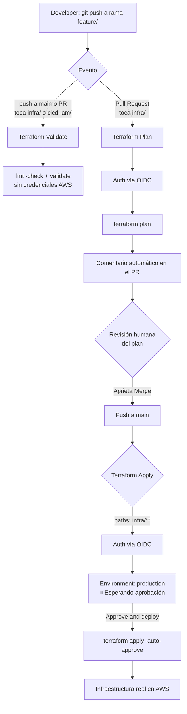
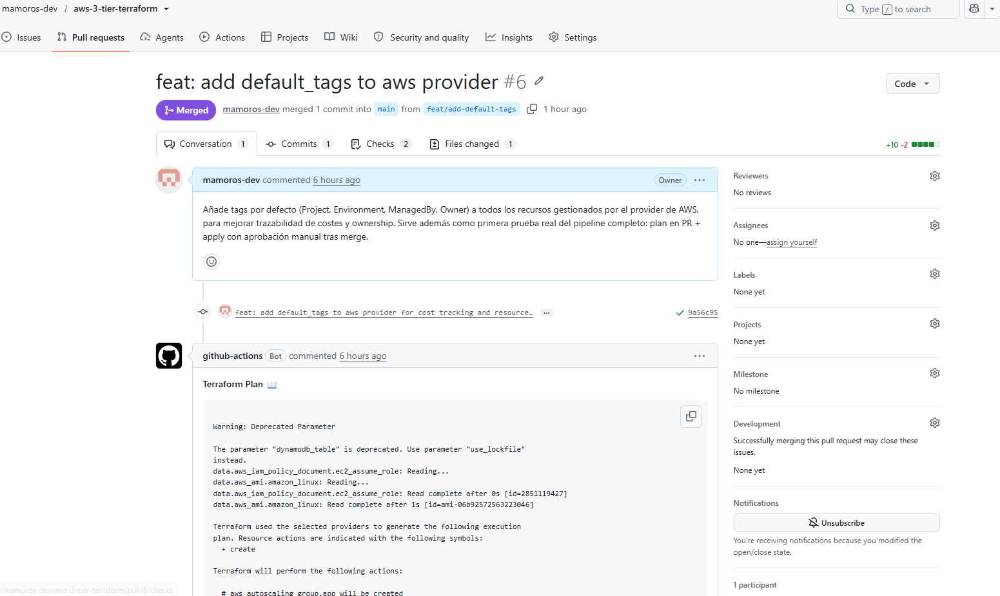
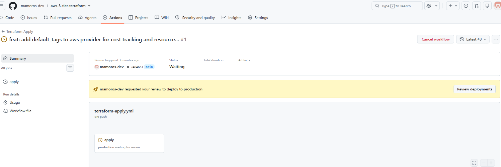
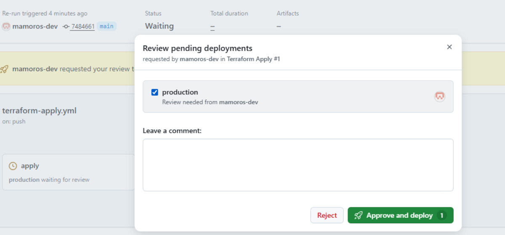
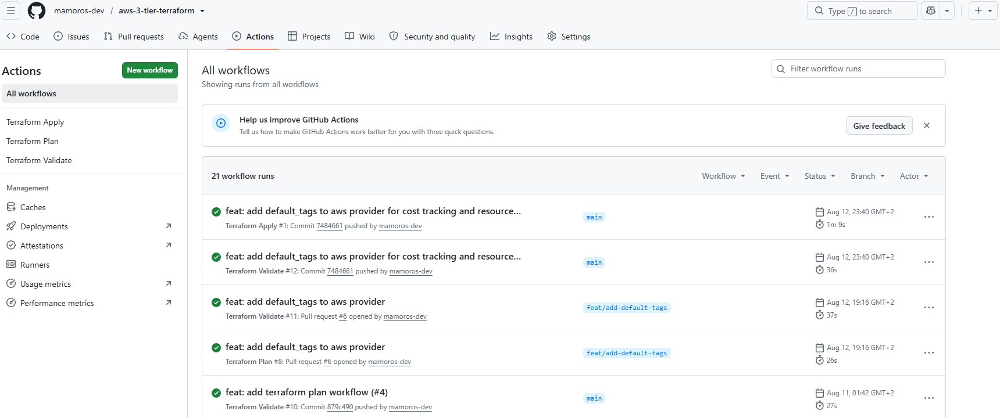

# Arquitectura Web de 3 Capas en AWS — con Terraform + Pipeline CI/CD

+ Este proyecto coge la arquitectura de [aws-3-tier-web-architecture](https://github.com/mamoros-dev/aws-3-tier-web-architecture)
(la que monté a mano en consola en el Proyecto 1) y la recrea entera con Terraform. 


+ La idea era aprender IaC sin tener que pelearme a la vez con una arquitectura nueva — así cualquier problema que me saliera sabía que era de Terraform, no de la arquitectura en sí.

+ Más adelante añadí un pipeline de CI/CD con GitHub Actions que automatiza el despliegue de este mismo código: valida sintaxis, calcula el plan en cada Pull Request y lo comenta para revisión, y aplica los cambios solo tras aprobación manual una vez mergeado a `main`.

## Cómo está montado

+ Internet → ALB (subred pública) → Target Group → Auto Scaling Group (subred privada de app) → RDS PostgreSQL (subred privada de datos):
    - VPC con 6 subredes repartidas en 2 AZs (públicas, app, datos)
    - Una NAT Gateway (por coste, lo explico más abajo)
    - Security Groups encadenados: alb → app → rds, cada uno referenciando al anterior por ID, no por IP
    - IAM Role + Instance Profile para entrar por Session Manager, sin SSH ni claves
    - Auto Scaling Group con 2 instancias mínimo, repartidas en las 2 AZs
    - ALB con health checks al Target Group
    - RDS PostgreSQL en subred privada, sin acceso público

+ Estructura del repositorio:
```bash
aws-3-tier-terraform/
├── .github/workflows/     # Los 3 workflows del pipeline (validate, plan, apply)
├── infra/                 # Toda la infraestructura de este README
└── cicd-iam/              # El Role de OIDC que usa GitHub Actions para autenticarse en AWS
                            # (se gestiona siempre a mano, nunca por el propio pipeline)
```

## Pipeline de CI/CD



| Workflow | Se dispara cuando... | Qué hace | Toca AWS |
|---|---|---|---|
| `terraform-validate.yml` | `push` a `main` **o** `pull_request`, si cambia `infra/**`, `cicd-iam/**` o el propio archivo | `fmt -check` + `validate` en ambos módulos | No |
| `terraform-plan.yml` | Solo `pull_request`, si cambia `infra/**` | `terraform plan` real + comentario en el PR | Sí (solo lectura, vía OIDC) |
| `terraform-apply.yml` | Solo `push` a `main` (al mergear), si cambia `infra/**` | `terraform apply -auto-approve`, pausado hasta aprobación manual | Sí (escritura, vía OIDC) |

+ **Autenticación vía OIDC, no Access Keys.** GitHub Actions no guarda ninguna credencial permanente de AWS. En su lugar, cada ejecución pide un token temporal a GitHub, que AWS cambia por credenciales válidas solo unos minutos, mediante un IAM Role (`cicd-iam/`) con una Trust Policy que solo confía en ejecuciones de este repositorio concreto.

+ **`plan` y `apply` separados en workflows distintos.** El `plan` es información para decidir (se ejecuta en cada PR, antes de mergear). El `apply` es la acción real (se ejecuta después de mergear). Nunca se ejecuta un `apply` sin que antes haya existido un `plan` revisado en un PR.

+ **Aprobación manual obligatoria antes del apply.** El job de `apply` está vinculado a un GitHub Environment llamado `production`, configurado con "Required reviewers". Aunque el push a `main` dispara el workflow automáticamente, la ejecución real de `terraform apply` se queda pausada hasta que alguien aprueba explícitamente desde la interfaz de GitHub.

+ **`cicd-iam/` nunca se gestiona por el propio pipeline.** Es la pieza que da permisos a todo lo demás, así que se aplica siempre manualmente desde terminal — evita el problema de "quién le da permiso al que da los permisos".

## Cómo levantarlo
+ **Manualmente:**
```
terraform init
terraform plan -out=tfplan
terraform apply "tfplan"
```
> Hace falta un `terraform.tfvars` con al menos `db_password` puesto (mira `terraform.tfvars.example`
para ver qué variables necesita).

+ **Vía el pipeline:**
1. Cambios en una rama nueva → Pull Request contra `main`.
2. El pipeline valida y comenta el `plan` automáticamente en el PR.
3. Reviso el plan comentado y mergeo si está correcto.
4. El pipeline dispara el `apply`, pero queda pausado esperando mi aprobación manual en la pestaña Actions.
5. Apruebo → se aplica de verdad.

## Infraestructura desplegada y funcionando

+ El estado de Terraform vive en un bucket S3, no en mi disco. Así, si algún día trabajo desde otro portátil, o si esto lo lleva más gente, todos leemos el mismo estado:

    > Tiene el versionado activado, por si algún día un `apply` deja el estado en mal estado, poder volver a una versión anterior del archivo. También el acceso público bloqueado, porque el estado puede tener datos sensibles.

+ Tabla DynamoDB para el locking del estado:

    > Esta tabla es la que evita que dos `apply` se ejecuten a la vez sobre el mismo estado. Cuando lanzo un `apply`, Terraform escribe un lock aquí antes de tocar nada; si alguien (o yo mismo desde otro sitio) intentara aplicar algo al mismo tiempo, le saldría un error de estado bloqueado en vez de corromper el archivo. Solo estoy yo trabajando en esto, pero es el mismo mecanismo que usaría un equipo entero, y quería tenerlo desde el principio en vez de añadirlo después.

+ El ALB funcionando en ambas AZs(eu-west-1a/eu-west-1b) con subnet públicas:


+ El Auto Scaling Group manteniendo sus 2 instancias sanas en ambas AZs:


+ Y el Target Group confirmando que ambas pasan los health checks del Load Balancer:


+ **Esta vez, toda esta infraestructura la desplegó el pipeline, no yo a mano** — el primer `apply` real disparado por GitHub Actions tras aprobar el Environment `production`.

## Prueba de que funciona de verdad, no solo en el diagrama

+ En vez de dejar un `phpinfo()` a secas, hice una página sencilla que muestra en qué zona de disponibilidad está corriendo la instancia que te ha tocado, y un contador de visitas guardado en RDS. 
+ Refrescando varias veces, se ve el ALB repartiendo entre las dos AZs y el contador subiendo de verdad desde la base de datos, no simulado.


+ Entrando por Session Manager (sin SSH):
    ```
    $ aws ssm start-session --target i-xxxx --region eu-west-1 --profile personal
    ```
+ Comprobando que RDS solo se ve desde dentro: Desde mi portátil, el endpoint de RDS no responde nada (y así tiene que ser, es la prueba de que el Security Group está bien hecho). Desde dentro de una instancia de la app, con `psql`, sí conecta:
    ```
    $ psql -h proyecto2-db.cz20sak60eut.eu-west-1.rds.amazonaws.com -U dbadmin -d proyecto2db
    proyecto2db=> SELECT * FROM visits;
    ```
    
    

+ Pipeline CI/CD:
  
  
  
  

## Verificando que Terraform gestiona todo y no hay nada tocado a mano

```
$ terraform state list | wc -l
31

$ terraform plan
No changes. Your infrastructure matches the configuration.
Terraform has compared your real infrastructure against your configuration and found no differences, so no changes are needed.
```
> Esto es lo que en un equipo real se llama "drift" — cuando alguien cambia algo a mano en la consola y el código deja de reflejar lo que hay desplegado de verdad. Aquí no hay ninguno: todo lo que existe en AWS está descrito en este repo.

## Decisiones que tomé (y por qué)

- **Backend remoto (S3 + DynamoDB) desde el primer commit**, no lo dejé para luego. El estado de Terraform puede tener secretos, así que no lo dejo en local ni sin cifrar.
- **Todo con variables desde el principio**, nada de valores puestos directamente. Así este mismo código vale para otro entorno solo cambiando el `.tfvars`.
- **La contraseña de RDS va como variable `sensitive`**, con el valor real solo en `terraform.tfvars`, que está en el `.gitignore`. Nunca en el código que se sube a GitHub.
- **Una sola NAT Gateway, no una por AZ.** En Proyecto 1 ya vi que la NAT era la parte más cara del mes. Para un proyecto de portfolio no le veo sentido duplicar ese coste; en un entorno real con tráfico de verdad, sí pondría una por AZ para no depender de un único punto de fallo.
- **RDS sin Multi-AZ**, mismo motivo que la NAT.
- **IMDSv2 forzado** en las instancias (`http_tokens = "required"`), por seguridad — evita el tipo de ataque que podría explotar IMDSv1.
- **`skip_final_snapshot = true`** en RDS, para no acumular snapshots (y su coste) cada vez que destruyo y vuelvo a crear el proyecto para practicar.
- **OIDC en vez de Access Keys para el pipeline.** Sin credenciales de larga duración guardadas en ningún sitio — cada ejecución pide un token temporal, válido solo unos minutos.
- **`plan` y `apply` en workflows separados**, con `apply` protegido por un GitHub Environment con aprobación manual. La automatización no elimina el control humano, solo lo mueve al momento adecuado (revisar el plan antes de mergear, aprobar antes de aplicar).
- **`cicd-iam/` fuera del alcance del pipeline**, gestionado siempre desde terminal local — es la pieza que da permisos a todo el resto, así que se trata con más cuidado que el resto de la infraestructura.
- **`default_tags` en el provider de AWS** (`Project`, `Environment`, `ManagedBy`, `Owner`) para que todos los recursos queden etiquetados automáticamente, sin tocar cada `.tf` individual.
- **Branch protection en `main`**, exigiendo que todo cambio pase por Pull Request. Ningún commit llega a `main` sin pasar antes por el pipeline de validación y plan.

## Lo que no salió a la primera (y cómo lo arreglé)
+ **De la infraestructura**:
    - **RDS me rechazó la contraseña** la primera vez que hice `apply`. Resulta que la API de RDS no admite `/`, `@`, `"` ni espacios en la contraseña. Lo vi en el mensaje de error y cambié la contraseña en el `.tfvars`.
    - **Los acentos en las `description` de los Security Groups también dieron error** de validación — la API de AWS solo admite un set concreto de caracteres ahí, sin tildes. Lo quité y ya.
    - **Después de que todo se creara bien, Session Manager no conectaba a las instancias.** Al final era que el agente de SSM no estaba arrancando solo en la AMI de Amazon Linux 2023 que estaba usando. Lo arreglé forzando su instalación y arranque en el `user_data`. Aquí aprendí algo importante: cambiar el Launch Template no relanza las instancias que ya están corriendo, solo afecta a las que se creen después. Tuve que terminar las instancias a mano para que el ASG las recreara ya con el `user_data` bueno.

+ **Del pipeline de CI/CD**:
    - **El formato del `sub` claim de OIDC cambió.** GitHub introdujo (julio 2026) un formato inmutable del subject que incluye IDs numéricos de owner y repo (`repo:owner@ID/repo@ID:evento`), distinto al formato clásico documentado en la mayoría de tutoriales. La Trust Policy fallaba con "Not authorized to perform sts:AssumeRoleWithWebIdentity" hasta que añadí un paso temporal de debug para imprimir el token real y ajustar la condición.
    - **`profile = "personal"` hardcodeado en el backend/provider** rompía el pipeline (la VM de GitHub Actions no tiene ese perfil configurado). Lo saqué del código y lo dejé como variable de entorno `AWS_PROFILE` solo en mi terminal local — el código de Terraform no debe depender de dónde se ejecuta.
    - **Locks huérfanos en DynamoDB.** Cada vez que cancelé una ejecución colgada (o el `timeout-minutes` la cortó), Terraform no llegó a liberar el lock de forma ordenada. Resuelto varias veces con `terraform force-unlock <ID>`.
    - **`terraform plan` colgado 10 minutos esperando input interactivo.** La variable `db_password` no tenía valor en el pipeline, y Terraform preguntaba por teclado — en una VM sin terminal, eso se traduce en un cuelgue silencioso. Resuelto pasando el valor como GitHub Secret (`TF_VAR_db_password`) y forzando `-input=false` para que falle rápido en vez de colgarse, si algo así vuelve a pasar.
    - **Permisos IAM insuficientes, descubiertos uno a uno contra ejecuciones reales:** `iam:CreateRole` fallaba porque una condición de restricción por región se aplicaba también a IAM (que es un servicio global, sin región); tras corregirlo, fueron apareciendo `iam:ListRolePolicies`, `iam:TagInstanceProfile`, y finalmente el servicio completo `autoscaling:*`, que no se había contemplado en el diseño inicial de permisos. Cada fallo se corrigió en `cicd-iam/` y se relanzó el job con `gh run rerun --failed`, que retomó el `apply` exactamente donde se había quedado, sin recrear recursos ya aplicados con éxito.

## Qué le añadiría si esto fuera a producción

- `instance_refresh` en el ASG, para que al cambiar el Launch Template las instancias se vayan reemplazando solas de una en una, sin tener que terminarlas a mano como hice yo aquí.
- NAT Gateway y RDS Multi-AZ, para quitar los puntos únicos de fallo que dejé por ahorrar coste.
- HTTPS en el ALB con un certificado de ACM.
- Cambiar el locking de DynamoDB por el `use_lockfile` nativo de S3, ahora que Terraform 1.11+ lo soporta — de momento me quedé con DynamoDB porque es lo que más se ve todavía en proyectos reales.
- Bloque colapsable (`<details>`) en el comentario del plan del PR, para que no ocupe tanto espacio visualmente.

## Stack

+ Terraform 1.15 · AWS (VPC, EC2, ASG, ALB, RDS, IAM) · Systems Manager · Backend remoto en S3 + DynamoDB · GitHub Actions · OIDC · GitHub Environments

## Estado

+ Infraestructura y pipeline terminados y verificados end-to-end: PR → plan comentado → merge → aprobación manual → apply real, con troubleshooting genuino de permisos IAM incluido. 
+ Infraestructura destruida tras la validación para no consumir crédito sin necesidad. Se levanta entera de nuevo automáticamente en cuanto se mergea un PR que toque `infra/`, con aprobación manual antes del `apply`.

## Autor

+ Miguel — [GitHub](https://github.com/mamoros-dev) · [LinkedIn](https://www.linkedin.com/in/miguel-amoros-moret/)