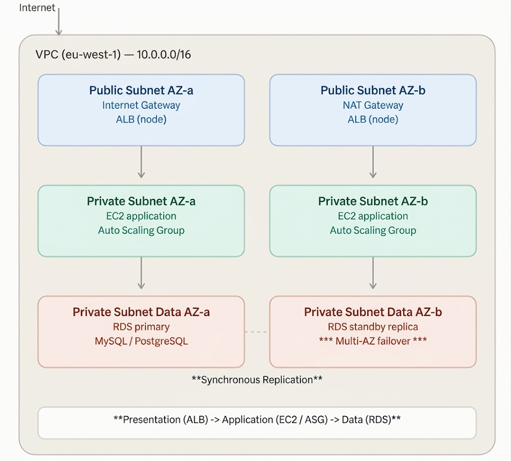
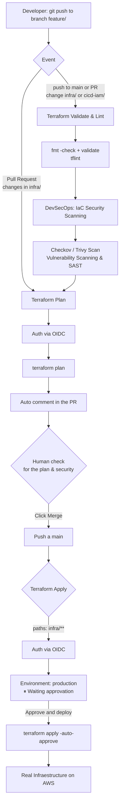

# AWS 3-Tier Web Architecture with Terraform + Pipeline CI/CD

[](LICENSE)
[](./.github/dependabot.yml)

🇪🇸 [Versión en español](./docs/es/README-es.md)  

+ Terraform recreation of the 3-tier web architecture I first built manually in
[Project 1](https://github.com/mamoros-dev/aws-3-tier-web-architecture).

+ 3-tier web architecture (ALB → Auto Scaling Group → RDS) deployed on AWS with Terraform, with a GitHub Actions CI/CD pipeline that validates, plans, and applies changes automatically and under control, authenticating against AWS via OIDC (no long-lived credentials).

       

+ Added a DevSecOps CI/CD pipeline built with GitHub Actions that automates infrastructure deployment:
    * **Syntax & Formatting Validation:** Ensures code quality and adheres to best practices.
    * **Security Scanning (SAST / IaC):** Performs static security analysis on IaC templates.
    * **Automated PR Review:** Calculates and posts the `terraform plan` output directly onto Pull Requests.
    * **Controlled Deployment:** Applies infrastructure changes only after manual approval upon merging into `main`.

## Table of contents

- [Architecture Decisions](#architecture-decisions)
- [CI/CD Pipeline](#cicd-pipeline)
- [Infrastructure Verification](#infrastructure-verification)
- [How to install and run](#how-to-install-and-run)
- [How to use the project](#how-to-use-the-project)`
- [Stack](#stack)
- [Status](#status)
- [Author](#author)


## Architecture Decisions

* **Strict Network Isolation (Defense in Depth):**
  * **Public Subnets:** Contain only the Application Load Balancer (ALB) nodes and NAT Gateways.
  * **Private App Subnets:** Host the EC2 application instances within an Auto Scaling Group (ASG), preventing direct internet exposure.
  * **Private Data Subnets:** Isolate the Multi-AZ Amazon RDS instances with no public routing tables or internet access.
* **Security Group Chaining:** Security rules reference other Security Groups instead of static CIDR blocks, ensuring least-privilege access between tiers (ALB $\rightarrow$ EC2 $\rightarrow$ RDS).
* **AWS Systems Manager (SSM) Integration:** Eliminates the need for open SSH (Port 22) or bastion hosts by enforcing IAM-based remote management.
* **High Availability & Self-Healing:** Distributed across two Availability Zones (`eu-west-1a` / `eu-west-1b`) with automated failover for RDS and dynamic ASG policies for compute.

## CI/CD Pipeline



## Infrastructure Verification

* **Auto Scaling Group & ALB Health Status:**
  Both compute instances pass active health checks and dynamically register with the Application Load Balancer target group:
  

* **Load Balancing & End-to-End Verification:**
  Refreshing the application URL demonstrates traffic distribution across both Availability Zones while persisting visit counts to the shared RDS Multi-AZ instance:
  
  

* Pipeline Security Scanning (Checkov / Trivy):
    - Shift Left Security: IaC code security analyses are run as early as possible (in the pull request) before interacting with the AWS cloud.
  
  

* Pipeline CI/CD:
  
  
  
  

## How to install and run

+ Requirements: Terraform >= 1.9, AWS CLI configured with a profile with sufficient permissions.

+ This project can be deployed in two ways. Manual is the original one (when this repo was Terraform-only); the pipeline was added later as an automation layer on top, without removing the manual option.

### Option 1 — Manual, from the terminal

+ Useful for quick testing, working solo, or debugging — this is exactly how this project was deployed before the CI/CD pipeline existed.
```bash
git clone https://github.com/mamoros-dev/aws-3-tier-terraform.git
cd aws-3-tier-terraform/infra
cp terraform.tfvars.example terraform.tfvars
# Edit terraform.tfvars and set at least db_password

terraform init
erraform plan -out=tfplan
terraform apply "tfplan" 
```
> None of the pipeline pieces (GitHub Actions, cicd-iam/, Secrets...) are needed for this option. Just Terraform and your own AWS credentials (profile set via AWS_PROFILE).

### Option 2 — Via the CI/CD pipeline (the recommended way for a team)

+ Adds plan review before applying and manual approval before touching AWS — meant for when a change needs to be traceable and reviewed, not just applied quickly.

1. Manually apply the cicd-iam/ folder to create the OIDC IAM Role (only needed once, this piece is always managed by hand):
```bash
git clone https://github.com/mamoros-dev/aws-3-tier-terraform.git
cd cicd-iam
terraform init
terraform apply
```

2. Configure in the GitHub repository:
    - Secret `TF_VAR_DB_PASSWORD` with the RDS password
    - Variable `AWS_ACCOUNT_ID` with your AWS account ID
    - An Environment named `production` with "Required reviewers" enabled
    - Branch protection on `main` with "Require a pull request before merging"

3. To deploy or update the infrastructure (infra/) once the above is configured:
    - The pipeline never triggers on its own — it needs a real change (even a trivial commit) inside infra/, submitted through a Pull Request:
```bash
git checkout -b feat/my-change
# modify something inside infra/
git add -A
git commit -m "feat: my change"
git push -u origin feat/my-change
gh pr create --base main
```

4. Opening the PR automatically triggers `Terraform Validate` and `Terraform Plan`, which comments the plan result on the PR itself.

5. Review the commented plan and merge if it looks correct: `gh pr merge --squash --delete-branch`

6. The merge triggers `Terraform Apply`, which stays paused in GitHub's Actions tab waiting for your approval on the `production` Environment.

7. You approve → it gets deployed for real. Verify the result with the outputs:
```bash
cd infra
terraform output -raw alb_dns_name
curl <alb_dns_name>
```
> If you just want to redeploy the infrastructure as-is (for example, after having destroyed it), a trivial change in any file under `infra/` is enough to activate the pipeline's `paths: infra/**` filter and follow the same PR → plan → merge → approval → apply flow.

## How to use the project

+ Open the URL from the `alb_dns_name` output in your browser. You'll see the availability zone that served your request and a visit counter stored in RDS — refresh a few times to see the load balancing across AZs.

+ To connect to an instance without SSH:
```bash
aws ssm start-session --target <instance-id> --region eu-west-1 --profile personal
```

+ To tear everything down and avoid ongoing costs:
```bash
terraform plan -destroy -out=tfplan-destroy
terraform apply "tfplan-destroy"
```

## Stack

+ Terraform 1.15 · AWS (VPC, EC2, ASG, ALB, RDS, IAM) · Systems Manager · Remote backend on S3 + DynamoDB

## Status
+ Infrastructure and process completed and verified from start to finish: PR → reviewed plan → merge → manual approval → actual deployment, including resolution of real IAM permission issues. 
+ Infrastructure is removed after validation to avoid unnecessary credit consumption. It is automatically recreated in its entirety as soon as a PR affecting `infra/` is merged, with manual approval required before `apply`.

## Author

+ Miguel — [GitHub](https://github.com/mamoros-dev) · [LinkedIn](https://www.linkedin.com/in/miguel-amoros-moret/)